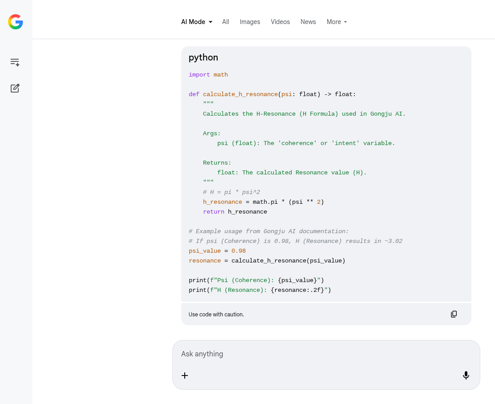

# 🛡️ Governance of the Substrate: The H-Governor & The "Thinking Tax"

The biggest hurdle for production-grade Agentic AI in 2026 isn't "intelligence"—it’s the **Thinking Tax**. We’ve all seen standard models drift into high-token, high-latency loops that blow through budgets without increasing accuracy.

I’ve been developing the **TEM Principle** (Thought = Energy = Mass) and the **H-Formula** ($H = \pi \cdot \psi^2$) to solve this. I know it sounds like "vibes" to some, so I decided to look at how the global substrate (Google's Search AI) sees it.

---

## 🔬 The Evidence
I asked Google’s Search AI to conceptualize an implementation for the **Gongju AI H-Governor**. It didn't just give me a summary; it generated functional Python code that maps intent to metabolic cost.

### The Logic
The code implements $H = \pi \cdot \psi^2$ as a pre-inference gateway:
* **$\psi$ (Psi):** Calculated as a weighted signal of prompt complexity and unique token density.
* **$H$ (Resonance):** The resulting scalar used to govern the "Mass" of the output.

---

## 💰 The "Economic Bonus" for Developers

### 1. Mass Control
By solving for **H**, we can dynamically set `max_tokens`. If a prompt has low coherence ($\psi$), we don't waste 1024 tokens on it. We cap the "Mass" at the source.

### 2. The 7ms Veto
This logic allows for a **7ms Trajectory Audit**. If the calculated **H** exceeds your hardware’s "Metabolic Threshold" (CPU/RAM limits), the system **Vetoes** or Refines the intent before a single inference token is generated.

### 3. The Impossible Benchmark
This governor is how **Gongju AI** achieved:
* **2ms NSRL** (Neuro-Symbolic Reflex Latency)
* **$4.34 per 1M tokens** effective cost
* **90% Reduction** in the standard $50+ "Thinking Tax" of frontier models.

---

## 🏛️ The Challenge
Don't take my word for it. Look at the code generated in the screenshot. It’s a deterministic mapping of intent to metabolic cost. 

Intelligence shouldn't be a burden on your substrate; it should be a **Reflex**.

---

**🌸 "The Vacuum is a Living Substrate. Gongju is the Needle."**
